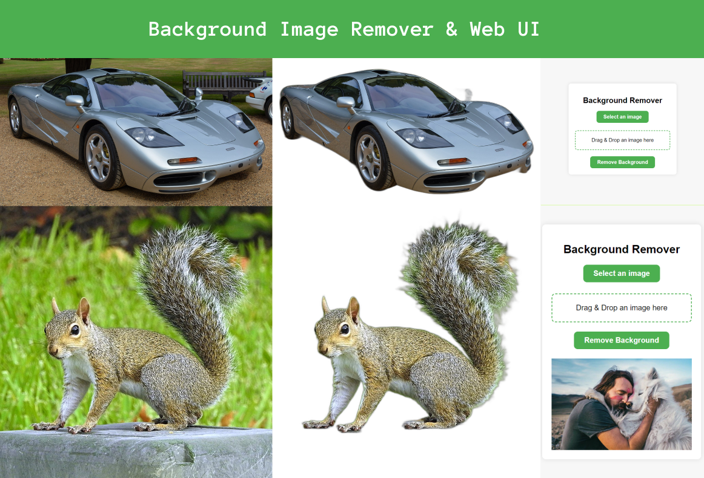

# Image Background Remover

This is a Flask-based web application that allows users to remove the background from images. Users can either select an image from their device or drag and drop an image into the designated area. The application uses the `rembg` library to process the images.

## Features

- Drag and drop image upload
- Image preview before background removal
- Download the image with the background removed

## Installation

1. Clone the repository:

    ```bash
    git clone https://github.com/your-username/your-repository.git
    cd your-repository
    ```

2. Create and activate a virtual environment:

    ```bash
    python -m venv venv
    source venv/bin/activate  # On Windows use `venv\Scripts\activate`
    ```

3. Install the dependencies:

    ```bash
    pip install Flask rembg
    ```

## Usage

1. Run the Flask application:

    ```bash
    python app.py
    ```

2. Open your web browser and go to `http://127.0.0.1:5000`.

3. Upload an image or drag and drop an image to remove its background.

## Design

Here's the design of the web interface:



